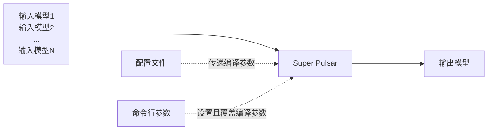

# 配置文件
[无 tasks 版本](/super_pulsar/config/config_without_tasks.md)

[有 tasks 版本](/super_pulsar/config/config_with_tasks.md)

## 背景
* Super Pulsar 是一个功能强大且复杂的工具集，它在编译、仿真、调试模型中往往需要获得必要的配置参数，才能精确地按照预想的方式工作
* 当前，所有的参数都可以通过配置文件传递给 Super Pulsar，少数参数可以通过命令行参数接口临时指定或修改
* 配置文件除了给编译器传递配置参数以控制编译器的，它还有一个重要的作用是可以指导编译器完成复杂的编译过程


* 注意：
  * 通过命令行参数接口传递的编译参数，将覆盖配置文件提供的参数

## 内容格式
* 当前配置文件格式是一种叫 prototxt 的文本格式，其内容可以直接借助文本编辑器进行阅读和修改
* prototxt 格式的配置文件可以表达结构化的信息：可以使用结构体、数组和 union 等格式
* prototxt 格式的配置文件内部可以使用注释
  * 注释以 `#` 开头
* 配置文件数据类型演示示例：
  * 注意：此示例中的配置文件内容，仅用于展示配置文件中的数据结构，无法用于任何实际的编译过程，因为它不完整

```prototxt
# file name: my_config.prototxt
# this is a comment
tasks { # 结构体类型
    target_hardware: TARGET_HARDWARE_AX630 # 枚举类型
    # 接下来的两个 `input_model_items` 组成一个长度为 2 的数组
    input_model_items {
        # `input_model_items` 数组中的第一个元素，其索引为 0
        task_output {
            name: "compile_hdr"
        }
    }
    input_model_items {
        # `input_model_items` 数组中的第二个元素，其索引为 1
        model {
            path: "nr_model.lava_joint"
        }
    }
    # 其它必要的配置项
}
```

## 名词约定
* 由于配置文件结构复杂，且配置参数层级较深，为了方便描述，尽可能减少因用词不当造成理解上的偏差，在此约定一些常用名词的含义
* 如果您在阅读本系列使用文档中发现有任何表达不清、用词错误等等问题或者有更好的建议，欢迎批评指正

### 参数路径
* **参数路径**用于表达某一个配置参数在多层结构体参数中的位置
* 当一个配置参数位于其它具有多个嵌套层级的结构体中时，将使用各级结构体参数的名称加点号 `.` 组成的字符串来表达当前正在介绍的参数在配置文件中的位置，如
  * 用字符串 `tasks.input_model_items.model` 代表的参数在配置文件中的位置如下：

```prototxt
# my_config.prototxt

tasks {
    input_model_items {
        model { # 正在被描述的结构体类型参数
            type: MODEL_TYPE_MAGMA # 正在被描述的的结构体内部的一个字段
        }
    }
}
```

* 参数路径举例：

```prototxt
# my_config.prototxt

tasks {                            # 参数路径：tasks
    name: "compile_hdr"            # 参数路径：tasks.name 参数值："compile_hdr"
    input_model_items {            # 参数路径：tasks.input_model_items
        model {                    # 参数路径：tasks.input_model_items.model
            type: MODEL_TYPE_MAGMA # 参数路径：tasks.input_model_items.type 参数值：MODEL_TYPE_MAGMA
        }
    }
}
input_task_names: "compile_hdr"  # 参数路径：input_task_names  参数值："compile_hdr"
output_task_names: "compile_hdr" # 参数路径：output_task_names 参数值："compile_hdr"
```

* 注意：
  * 这里**把配置文件本身当做一个匿名的结构体**，它内部的一级参数的路径就是参数名称本身
  * 当介绍**通用数据类型**时不标注参数路径，因为它们可能出现在配置文件的多个地方
* 有些地方会使用参数完整路径或相对来表达一个参数名称

### 编译过程
* 编译过程一般用于代指将一种格式的模型编译成另一种格式。如：
  * 把一个 onnx 格式的模型编译成 joint 格式
  * 把一个 magma 格式的模型编译成一个 lava_joint 格式

### 编译步骤
* 编译步骤一般用于一个编译过程可以明确地分出几个步骤的情况中。如
  * 将两个 magma 模型先编译成 joint 格式，然后再将两个 joint 格式的模型融合得到一个 joint 模型
* 我们在描述配置文件的时候，可能会说“整个编译过程分为三个编译步骤，每一个**编译步骤**的配置参数”......
* 但是当我们要具体描述一个**编译过程**中的某一个**编译步骤**时，又可能在一个小节内会将**编译步骤**说成**编译过程**，这个时候这两个词多代指的对象是一样的。注意结合上下文区分

### 编译参数
* 编译参数用于代指**编译过程**或**编译步骤**所需要配置的参数

## 配置文件的两个重要版本
由于历史原因，现在常见的配置文件内容格式有两种风格略有差异的版本：[无 tasks 版本](/super_pulsar/config/config_without_tasks.md)和[有 tasks 版本](/super_pulsar/config/config_with_tasks.md)

> 事实上，无 tasks 的配置文件在被导入编译器后会经过一个预处理的过程，最终转换成一份具有一个 [tasks](#tasks) 的配置信息


### 版本一：无 tasks 的配置文件
* 无 tasks 的配置文件属于较早的版本
* 它能够指导大部分常用的编译过程，但表达能力具有一定的局限性，有些功能无法实现
* [详情](/super_pulsar/config/config_without_tasks.md)

### 版本二：有 tasks 的配置文件
* 有 tasks 的配置文件是当前最新的配置文件形式。***当前作为实验版本***
* [详情](/super_pulsar/config/config_with_tasks.md)

