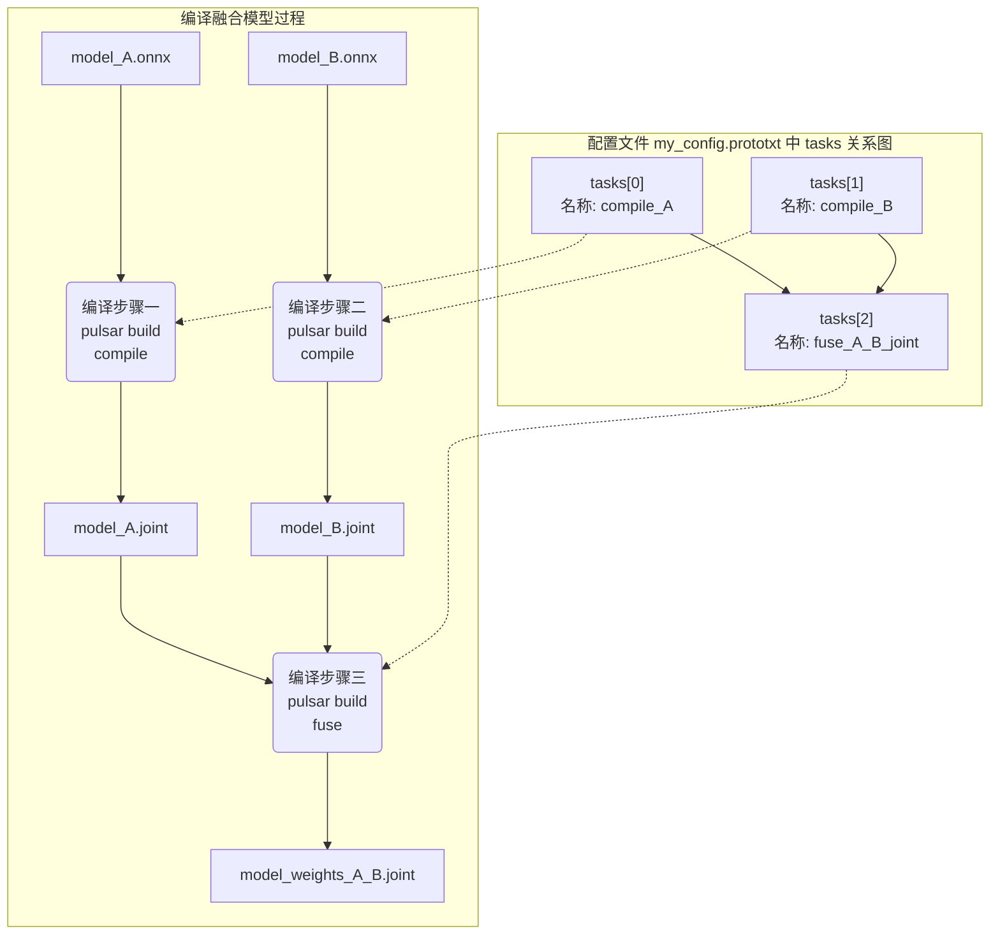

## 多 tasks 级联
在[有 tasks 配置文件](/super_pulsar/config/config_with_tasks.md)中，可以定义多个 tasks 结构体。这些 tasks（tasks 结构体数组），可以以 tasks 作为节点，以 task.input_model_items.task_output 作边构建出一个有向无环图，从而完成复杂的编译过程

### 示例
假设有两个**网络结构完全一样，权重不一样**的 onnx 模型，希望将它们编译并合并成一个具有多份权重的 joint 模型。则配置文件示例如下

```prototxt
# my_config.prototxt

tasks {
    name: "compile_onnx_A"
    input_model_items {
        model {
            type: MODEL_TYPE_ONNX
            path: "model_A.onnx"    # 原始输入模型
        }
    }
    output_model_items {
        model {
            type: MODEL_TYPE_JOINT
            path: "./model_A.joint" # 中间模型
        }
    }
    target_hardware: TARGET_HARDWARE_AX630
    neuwizard_conf {
        dataset_conf_calibration {
            path: "imagenet-1k-images.tar" # 一个具有 1000 张图片的 tar 包，用于编译过程中对模型校准
            type: DATASET_TYPE_TAR
            size: 256
        }
    }
    pulsar_conf {
        batch_size: 1
        debug: true
    }
}
tasks {
    name: "compile_onnx_B"
    input_model_items {
        model {
            type: MODEL_TYPE_ONNX
            path: "model_B.onnx"    # 原始输入模型
        }
    }
    output_model_items {
        model {
            type: MODEL_TYPE_JOINT
            path: "./model_B.joint" # 中间模型
        }
    }
    target_hardware: TARGET_HARDWARE_AX630
    neuwizard_conf {
        dataset_conf_calibration {
            path: "imagenet-1k-images.tar" # 一个具有 1000 张图片的 tar 包，用于编译过程中对模型校准
            type: DATASET_TYPE_TAR
            size: 256
        }
    }
    pulsar_conf {
        batch_size: 1
        debug: true
    }
}
tasks {
    name: "fuse_A_B_joint"
    input_model_items {
        # 指定输入模型 1 来自于 tasks: "compile_A" 的输出
        task_output {
            name: "compile_onnx_A"
        }
    }
    input_model_items {
        # 指定输入模型 2 来自于 tasks "compile_B" 的输出
        task_output {
            name: "compile_onnx_B"
        }
    }
    output_model_items {
        model {
            path: "./model_multi_weights_A_B.joint" # 编译后模型(最终输出模型)
            type: MODEL_TYPE_JOINT
        }
    }
    joint_conf {
        fuse_neu_mcode_wbt {
            model_nodes {
                model_index: 0
                wbt_name: "weights_A"
            }
            model_nodes {
                model_index: 1
                wbt_name: "weights_B"
            }
        }
    }
}
input_task_names: "compile_onnx_A"
input_task_names: "compile_onnx_B"
output_task_names: "fuse_A_B_joint"
```

* 示例中，整个编译流程中有三个大的编译步骤，每一个编译步骤在配置文件里对应一个 `tasks` 结构体

|编译步骤  |参数路径|tasks 的名称   |tasks 的输入模型        |tasks 的输出模型       |tasks 的作用|
|--------|--------|--------------|-----------------------|---------------------|-----------|
|编译步骤一|tasks[0]|compile_onnx_A|原始输入模型 model_A.onnx|中间模型 model_A.joint|将 model_A.onnx 模型编译成 model_A.joint
|编译步骤二|tasks[1]|compile_onnx_B|原始输入模型 model_B.onnx|中间模型 model_B.joint|将 model_B.onnx 模型编译成 model_B.joint
|编译步骤三|tasks[2]|fuse_A_B_joint|中间模型<br/>model_A.joint<br/>model_B.joint|编译后模型<br/>model_weights_A_B.joint|将 model_A.joint 和 model_B.joint 的权重融合在一起，得到一个具有两份权重的模型 model_weights_A_B.joint

### 原理介绍
* 各个编译步骤之间有**先后关系**，由对应的 `tasks` 结构体在配置文件中出现的先后顺序决定。如：
  * 名称（`tasks.name`）为 `"compile_onnx_A"` 的 tasks[0] 是配置文件中第一个被定义的 tasks 结构体，因此它最先被执行
  * 名称（`tasks.name`）为 `"fuse_A_B_joint"` 的 tasks[2] 是配置文件中最后一个被定义的 tasks 结构体，因此它最后被执行
* 编译步骤之间存在**依赖关系**，由对应的 `tasks` 结构体中的 `input_model_items` 参数来指定。`input_model_items` 指示了当前 `tasks` 所对应的编译步骤的输入模型来自于**前面**的哪几个 `tasks` 所对应的编译步骤。如：
  * 名称（`tasks.name`）为 `"fuse_A_B_joint"` 的 tasks 有两个**输入模型**，这两个输入模型是前面的两个 tasks 的**输出模型**
    * tasks[2].input_model_items[0].task_output: "compile_onnx_A" 表示 tasks compile_onnx_A 的输出模型，作为 tasks fuse_A_B_joint 的第一个输入模型
    * tasks[2].input_model_items[1].task_output: "compile_onnx_B" 表示 tasks compile_onnx_B 的输出模型，作为 tasks fuse_A_B_joint 的第二个输入模型
  * 排在第一位或前几位的 `task` 所对应的编译步骤的输入模型是原始输入模型。如，tasks[0] 和 tasks[1] 的输入模型分别是原始输入模型 model_A.onnx 和 model_B.onnx
* 每一个编译步骤的编译参数按不同的编译步骤而定。其中：
  * 编译步骤一和编译步骤二都是将 onnx 格式模型编译成 joint 格式。和常规的编译过程一样。详情请参考[有 tasks 配置文件](/super_pulsar/config/config_with_tasks.md)
  * 编译步骤三是将两个**网络结构相同，权重不同**的 joint 模型融合在一起，需要配置 joint_conf.fuse_neu_mcode_wbt 参数。详情请参考 [生成一份 mcode 多份 wbt 的 joint 模型](/use_case/mcode_wbt.md)

### 编译流程和配置文件的关系图
* 编译步骤和配置文件中 tasks 的对应关系


