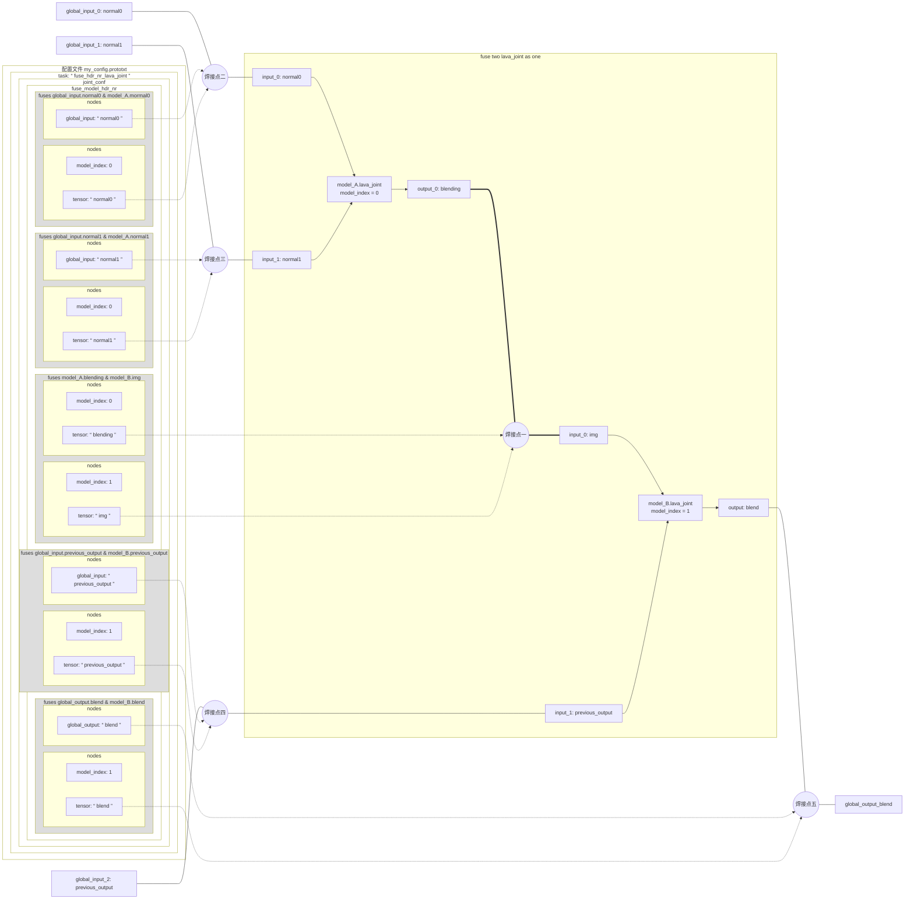

## 模型焊接
* 参数路径：
  * [无 tasks 配置文件](/super_pulsar/config/config_without_tasks.md): [joint_conf](/super_pulsar/config/config_without_tasks.md#joint_conf).fuse_model
  * [有 tasks 配置文件](/super_pulsar/config/config_with_tasks.md): [tasks](/super_pulsar/config/config_with_tasks.md).[joint_conf](/super_pulsar/config/config_with_tasks.md#joint_conf).fuse_model
* 参数作用：
  * 用于描述模型焊接过程中，被焊接的模型之间的关联关系

### 示例
```prototxt
tasks {
    name: "fuse_two_lava_joint" # tasks 的名称
    joint_conf {
        fuse_model {
            # 焊接点一：将 model_A.lava_joint 的输出 tensor ： blending 与 model_B.lava_joint 的输入 tensor : img 焊接在一起
            fuses {
                nodes {
                    model_index: 0
                    tensor: "blending"
                }
                nodes {
                    model_index: 1
                    tensor: "img"
                }
            }
            # 焊接点二：将 model_A.lava_joint 的输入 normal0 与全局输入 tensor 焊接在一起
            fuses {
                nodes {
                    model_index: 0
                    tensor: "normal0"
                }
                global_input: "normal0"
            }
            # 焊接点三：将 model_A.lava_joint 的输入 normal1 与全局输入 tensor 焊接在一起
            fuses {
                nodes {
                    model_index: 0
                    tensor: "normal1"
                }
                global_input: "normal1"
            }
            # 焊接点四：将 model_B.lava_joint 的输入 previous_outout 与全局输入 previous_output 焊接在一起
            fuses {
                nodes {
                    model_index: 1
                    tensor: "previous_output"
                }
                global_input: "previous_output"
            }
            # 焊接点五：将 model_B.lava_joint 的输出 blend 与全局输出 blend 焊接在一起
            fuses {
                nodes {
                    model_index: 1
                    tensor: "blend"
                }
                global_output: "blend"
            }
        }
    }
    # 输入模型一：model_A.lava_joint
    input_model_items {
        # 模型索引 model_index 为 0，因为当前 input_model_items 结构体是长度为 2 的数组的第一个元素，它的编号为 0
        model {
            path: "model_A.lava_joint"
        }
    }
    # 输入模型二：model_B.lava_joint
    input_model_items {
        # 模型索引 model_index 为 1，因为当前 input_model_items 结构体是长度为 2 的数组的第二个元素，它的编号为 1
        model {
            name: "model_B.lava_joint"
        }
    }
    # 输出模型：给焊接后的模型命名为 "fused_model.lava_joint"
    output_model_items {
        model {
            path: "fused_model.lava_joint"
            type: MODEL_TYPE_LAVA_JOINT
        }
    }
}
```

* [焊接点与配置文件中的 fuses-nodes 之间的关系图](#焊接点与配置文件中的-fuses-nodes-之间的关系图)

### 字段说明
#### fuses
* 参数路径：
  * joint_conf.fuse_model.fuses
* 参数作用：
  * `fuses` 在模型焊接功能中，用于描述焊接点。在编译的过程中，编译器会将这两个 tensor 融合成为一个 tensor
  * 焊接模型的过程中，可能有多个焊接点
  * 焊接点可分为两类：
    * 第一类焊接点：模型与模型之间的焊接点
    * 第二类焊接点：模型与全局输入/输出之间的焊接点
      * 这一类焊接点，其实不是真正的焊接。只是用来告诉编译器，**焊接后的模型**的**输入**和**输出** tensor 分别来自于哪些**焊接前的模型**
* 字段说明：
  * `nodes`: 一个[结构体](#nodes)数组。用于指定焊接点一方或双方都来自输入模型的 tensor
    * 当数组长度为 1 时，代表焊接点只有一方来自输入模型。另一方必须是 `global_input` 或 `global_output` 所指定的全局输入或输出 tensor 之一
    * 当数组长度为 2 时，一般代表焊接点的双方都来自输入模型的 tensor
    * [字段说明](#nodes)
  * `global_input`: 一个字符串。用于指定焊接点的一方是全局输入 tensor
  * `global_output`: 一个字符串。用于指定焊接点的一方是全局输出 tensor

##### nodes
* 参数路径：
  * tasks.joint_conf.fuse_model.fuses.nodes
* 作用：
  * `nodes` 在模型焊焊接中，用于确定一个模型中的一个 tensor
* 参数类型：结构体数组。结构体字段说明：
  * `model_index`: 一个整数。对应于当前 `tasks` 的输入模型列表 `tasks.input_model_items` 的数组索引（索引值从零开始）
  * `tensor`: 一个字符串。代表 tensor 的名称
  * `model`: 一个字符串。置空时表示取 Joint 对外 Tensor ；否则从内部模型取


### 焊接点与配置文件中的 fuses-nodes 之间的关系图

