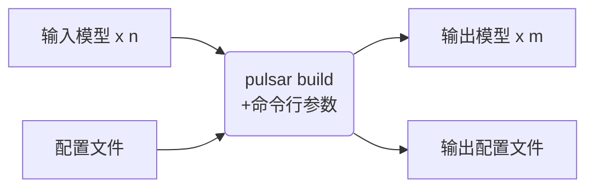
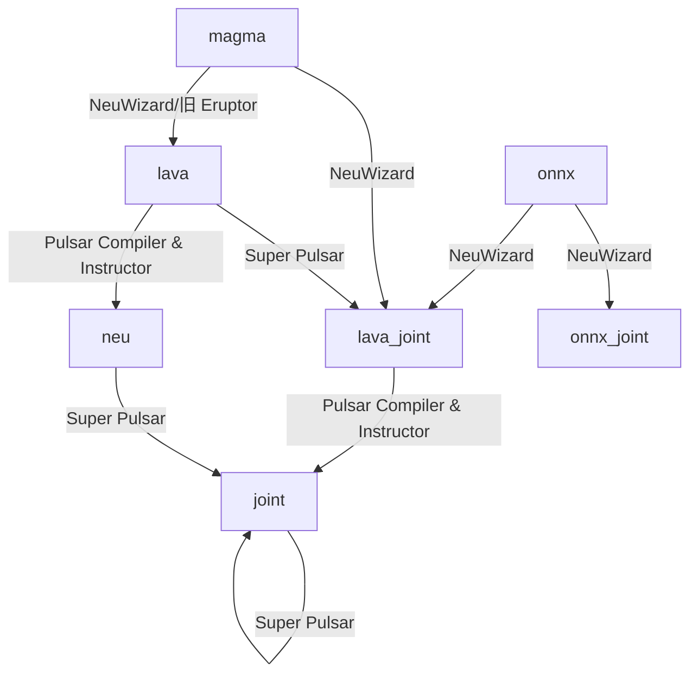

# pulsar build

## 概述

pulsar build 一般用于模型编译、合并等操作。其运行示意图如下：



即 `pulsar build` 接收若干输入模型与一个配置文件，编译后得到若干输出模型与一个输出配置文件。

`pulsar build` 的命令行参数将会覆盖配置文件中的对应部分，并使 `pulsar build` 将覆盖过后得到的配置文件输出出来。

配置文件的详细介绍见[此处](./config.md)。

目前 `pulsar build` 支持的输入输出模型类型示意图如下：



## 用法

```bash
pulsar build [OPTIONS]
```

## 选项
### `--input`
本次编译的输入模型路径，将会按顺序覆盖配置文件中每个 `task` 中输入模型的路径。

### `--output`
指定输出模型的文件名，如 `compiled.joint`

### `--config`
指定用于指导本次编译过程所用的基本配置文件。  
如果为 `pulsar build` 命令指定了命令行参数，则转换模型过程中优先使用命令行参数中指定的值。

### `--output_config`
将本次编译过程所使用的完整配置信息输出到文件。默认不输出
> 此处输出的配置文件将用于 `pulsar run` 等其它功能中。

### `--target_hardware`
指定编译输出模型所适用的硬件平台：
* `AX630`
* `AX620`

### `--virtual_npu`
指定推理时使用的虚拟 NPU ，请根据 `--target_hardware` 参照[平台介绍](../hardware/AX630A.md)

### `--output_dir`
指定编译过程的工作目录。默认为当前目录

### `--calibration_batch_size`
转模型过程中，内部参数校准时所使用数据的 batch_size。默认值为 32

### `--batch_size_option`
设置 joint 格式模型所支持的 batch 类型：  
* `BSO_AUTO`：默认选项，默认为静态 batch
* `BSO_STATIC`：静态 batch，推理时固定 batch_size，性能最优
* `BSO_DYNAMIC`：动态 batch，推理时支持不超过最大值的任意 batch_size，使用最灵活

### `--compile_batch_size`
设置 joint 格式模型所支持的 batch size。默认为 1
* 当指定了 `--batch_size_option BSO_STATIC` 时，batch_size 表示 joint 格式模型推理时能用的唯一 batch size 
* 当指定了 `--batch_size_option BSO_DYNAMIC` 时，batch_size 表示 joint 格式模型推理时所能使用的最大 batch size 

* 当生成支持动态 batch 的 joint 格式模型时，可以在 `--compile_batch_size` 后面指定多个常用的 batch_size，以提高使用不超过这些值的 batch size 进行推理时的性能；（注意，指定多个 batch size 会增加 joint 格式模型文件的大小）

### `--input_tensor_color`
指定**输入**模型的**输入数据**的颜色空间，可选项：
* `auto`：默认选项，根据模型输入 channel 数自动识别。3-channel: bgr，1-channel: gray
* `rgb`
* `bgr`
* `gray`
* `nv12`
* `nv21`

### `--output_tensor_color`
指定**输出**模型的**输入数据**的颜色空间，可选项：
* `auto`：默认选项，根据模型输入 channel 数自动识别。3-channel: bgr，1-channel: gray
* `rgb`
* `bgr`
* `gray`
* `nv12`
* `nv21`

### `--color_std`
指定用于在 RGB 和 YUV 之间转换时所采用的转换标准，可选项：
* `studio`
* `full`
* 如果未指定，则默认值为 `legacy`

### `--qat_convert_mode`
指定 QAT 模型转换模式，可选项：
* `post-nw`：默认值。使用 NeuWizard 转 qat 模型
* `pre-nw`：使用 QAT-Eruptor 转 qat 模型

### `--enable_progress_bar`
* 编译时显示进度条。默认不显示
