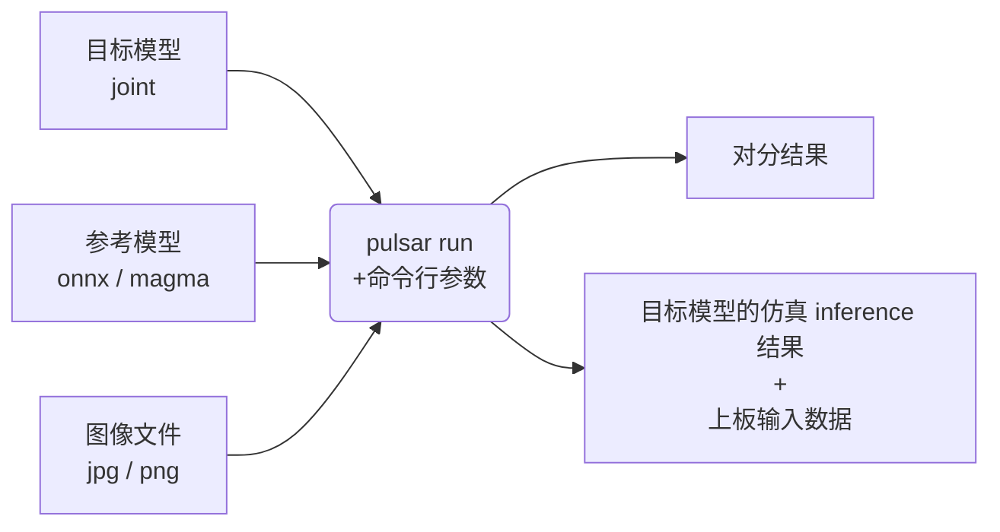

# pulsar run

## 概述

`pulsar run` 用于在 x86 平台上对 joint 模型进行仿真和对分。


## 用法
```bash
pulsar run target.joint reference.onnx <...> --input image_file1 image_file2 <...> --config config.prototxt
# 或者
pulsar run target.joint reference.magma <...> --input input_dict.json --config config.prototxt
```
其中：
* target.joint, reference.onnx, reference.magma 是需要被仿真的模型，可以输入多个模型，pulsar run 会做两两对分
* image_file1, image_file2 是用于仿真 inference 的输入数据，支持 jpg、png、bin 等格式，需要保证其个数与模型输入层个数一致
* input_dict.json 是用于仿真 inference 的输入数据（字典格式），需要填写为 "输入层名:输入数据路径"，只需要单个文件即可
* config.prototxt 一般由 `pulsar build` 的 `--output_config` 选项生成

## 选项

### `--input`
* 可以指定多个输入数据，并作为仿真 inference 的输入数据。支持 jpg、png、bin 等格式
  * 需要保证其个数与模型输入层个数一致
* 也能以 `.json` 形式呈现，此时只需要单个文件。其表示的字典格式为 "输入层名:输入数据路径"，输入数据文件可以是 jpg、png、bin 等格式

### `--layer`
* 不是必需项
* 当模型有多路输入时，用于指定输入数据对应哪一层。其顺序与 `--input` 呈对照关系
  * 比如 `--input file1.bin file2.bin --layer layerA layerB` 就代表给 `layerA` 输入 `file1.bin`、给 `layerB` 输入 `file2.bin`
  * 需要保证 `--layer` 的长度与 `--input` 的长度一致
* 当模型输入层名带有空格时，只能 fallback 到 `--input xxx.json` 的做法

### `--use_onnx_ir`
* 当使用 onnx 格式模型作为对分参考模型时，此选项用以告诉 `pulsar run` 在内部用 `NeuWizard IR` 推理 onnx 模型。默认不使用 `NeuWizard IR`
* 此选项只有在指定了 `--onnx` 时才有意义

### `--output_gt`
指定用于存放目标模型的仿真 inference 结果和上板输入数据的目录。默认不输出

### `--qat_convert_mode`
* 当使用 magma 格式模型作为对分参考模型时，此选项用于指定 `pulsar run` 内部转 QAT 模型的模式。
* 此选项只有在指定了 `--magma` 选项时才有意义。可选项：
  * `post-nw`：使用 neuwizard 转 qat 模型
  * `pre-nw`：默认值。使用 QAT-Eruptor 转 qat 模型

### `--config`
* 指定配置文件，用于指导 `pulsar run` 在内部转换参考模型。一般使用 `pulsar build` 的 `--output_config` 选项输出的配置文件

### [deprecated] `--onnx`
* 指定 onnx 格式模型文件作为对分参考模型
* 此选项跟 `--magma` 二选一使用

### [deprecated] `--magma`
* 指定 magma 格式模型文件作为对分参考模型
* 此选项跟 `--onnx` 二选一使用

### [deprecated] `--image`
指定一个图片文件，用于制作上板输入数据，并作为仿真 inference 的输入数据。只能输入单个文件。支持 jpg、png 等格式