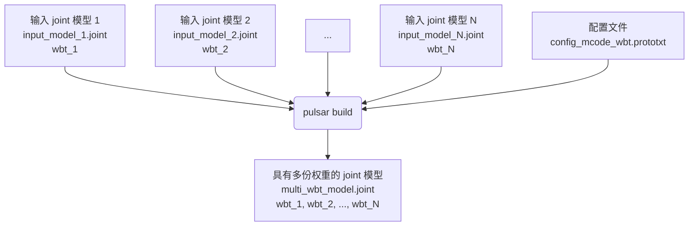

# 生成一份 mcode 多份 wbt 的 joint 模型

## 概述
使用 `pulsar build` 可以将多个**网络结构一样，网络权重不同**的 joint 模型，合成一个**具有多份权重**的 joint 模型


其中：
* `input_model_1.joint` ~ `input_model_N.joint` 是多个**网络结构一样，网络权重不同**的输入 joint 模型
* `wbt_1` ~ `wbt_N` 分别是输入模型 `input_model_1.joint` ~ `input_model_N.joint` 的权重的名称
* `config_mcode_wbt.prototxt` 是指导 `pulsar build` 合成模型的配置文件
* `multi_wbt_model.joint` 是一个**具有多份权重**的输出 joint 模型，其内部权重的名称依次为 `wbt_1` ~ `wbt_N`

## 编译方法
* 准备好配置文件后，执行下面的命令进行编译
  * 输出模型的名称由配置文件中的 `output_model_items` 结构体指定
```bash
pulsar build --config config_mcode_wbt.prototxt
```

## 配置文件示例
config_mcode_wbt.prototxt
```prototxt
tasks {
  name: "task_0"
  input_model_items {
    model {
      path: "input_model_1.joint"
      type: MODEL_TYPE_JOINT
    }
  }
  input_model_items {
    model {
      path: "input_model_2.joint"
      type: MODEL_TYPE_JOINT
    }
  }
  input_model_items {
    model {
      path: "input_model_N.joint"
      type: MODEL_TYPE_JOINT
    }
  }
  output_model_items {
    model {
      path: "multi_wbt_model.joint"
      type: MODEL_TYPE_JOINT
    }
  }
  joint_conf {
    fuse_neu_mcode_wbt {
      model_nodes {
        model_index: 0
        wbt_name: "wbt_1"
      }
      model_nodes {
        model_index: 1
        wbt_name: "wbt_2"
      }
      model_nodes {
        model_index: 2
        wbt_name: "wbt_N"
      }
    }
  }
}
input_task_names: "task_0"
output_task_names: "task_0"
```

## 自己修改配置文件的步骤
* 拷贝样例配置文件内容保存到新的配置文件。如 `my_config.prototxt`
* 根据实际输入模型的个数，增加或减少 `my_config.prototxt` 文件中的 `input_model_items` 和 `model_nodes` 结构体的数量。其中：
  * 一个 `input_model_items` 结构体代表一个输入模型
  * 一个 `model_nodes` 结构体代表一个输入模型的权重的名称
* 根据实际模型文件的名称，修改相应字段。其中：
  * `input_model_items` 结构体中的字段 `path` 表示输入模型文件的路径全称，如 `"input_model_1.joint"` ~ `"input_model_3.joint"`
    * 注意：路径是 `my_config.prototxt` 所在目录的相对路径
  * `model_nodes` 结构体中的字段 `wbt_name` 表示输入模型的权重名称，如：`"wbt_1"` ~ `"wbt_3"`
    * 注意 `model_nodes` 结构体中的字段 `model_index` 代表当前结构体描述的是哪一个输入模型，输入模型的序号从 0 开始编号
* `output_model_items` 结构体的字段 `path` 用于描述输出模型的路径和名称
  * 注意：路径是 `my_config.prototxt` 所在目录的相对路径
* 所有的 `type` 字段必须填写为 `MODEL_TYPE_JOINT`
